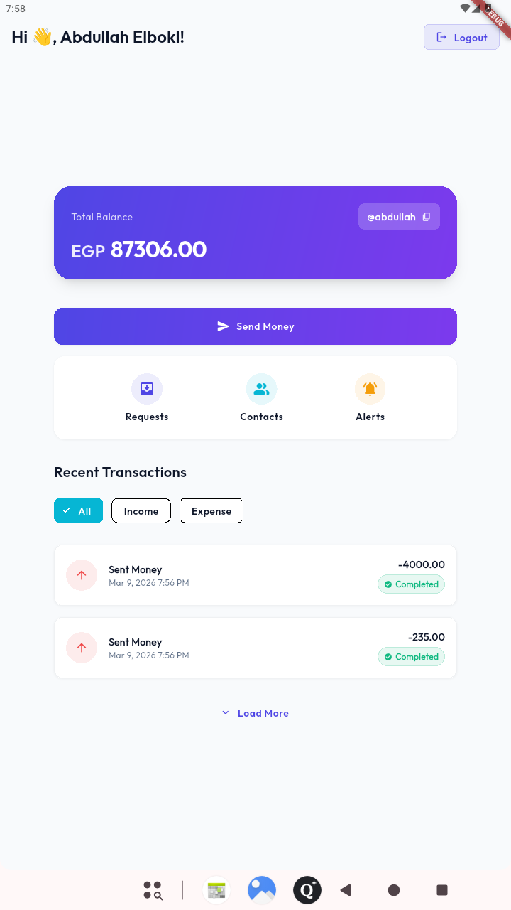
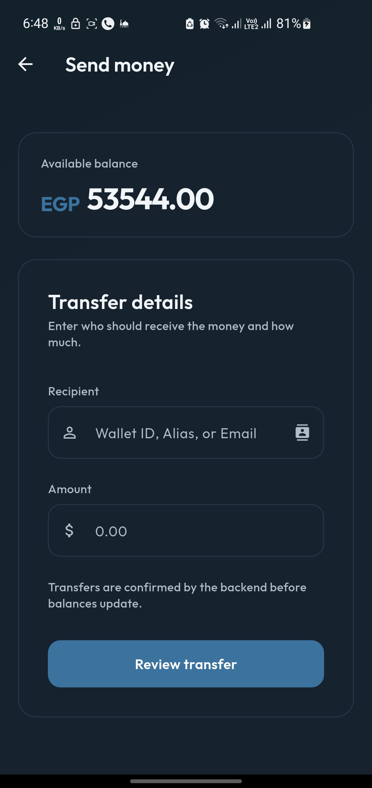
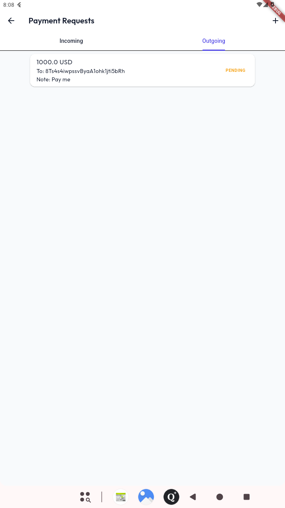
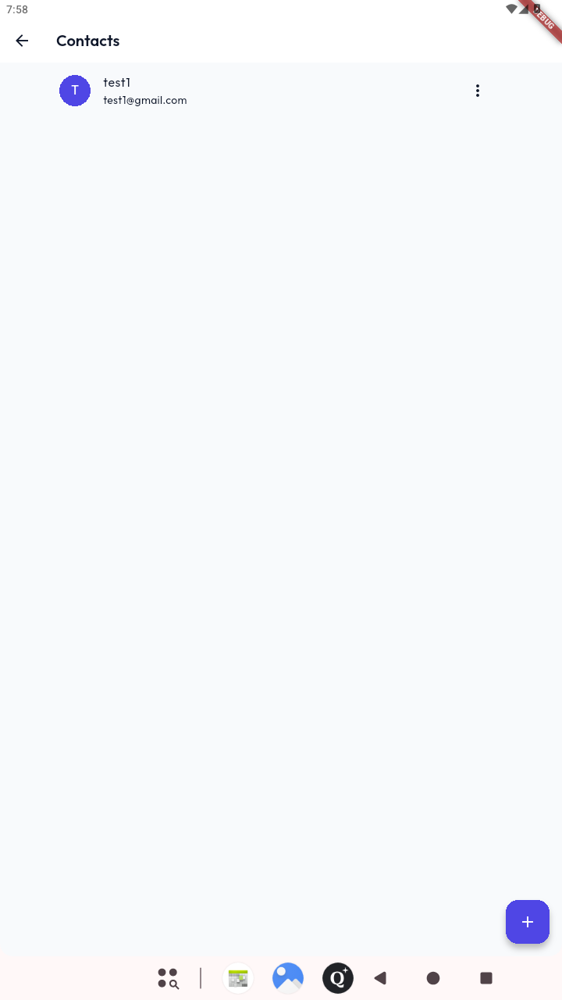
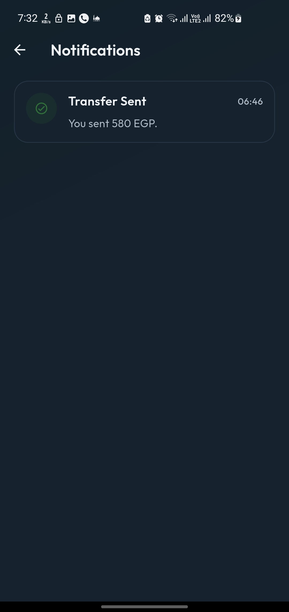
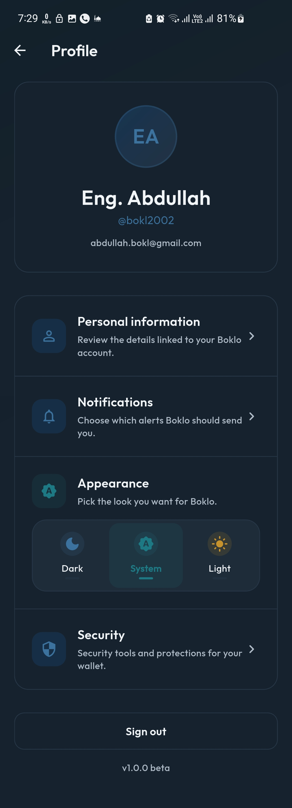
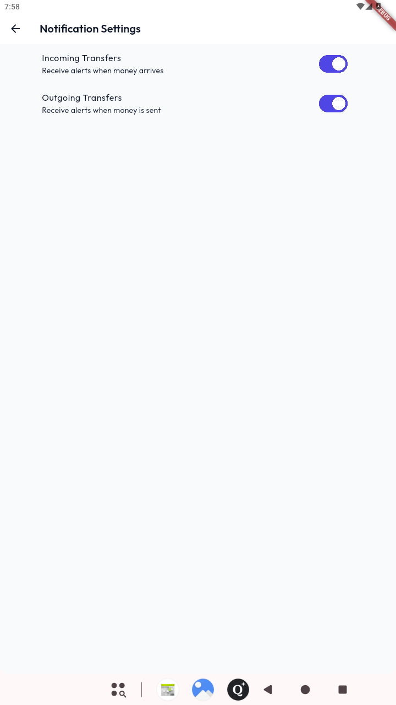
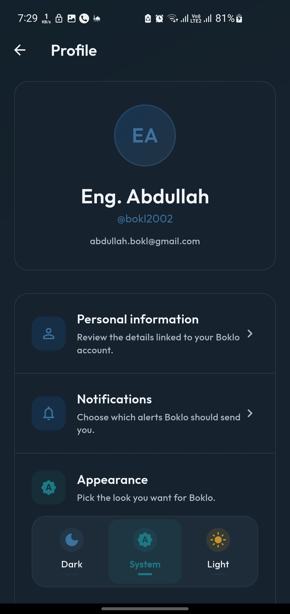
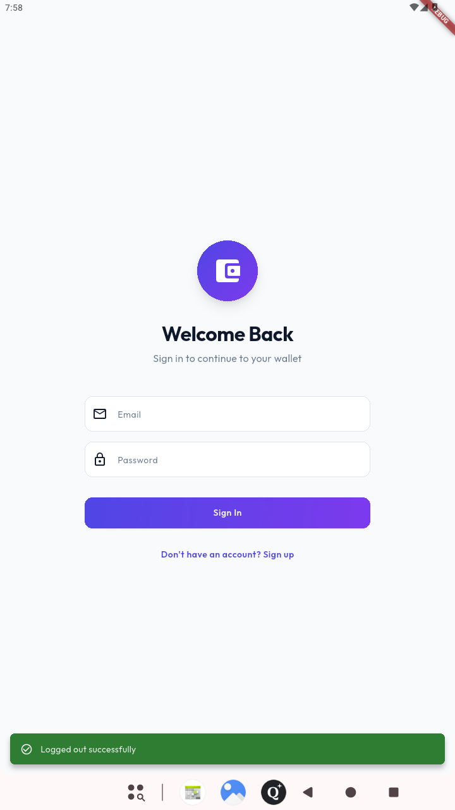
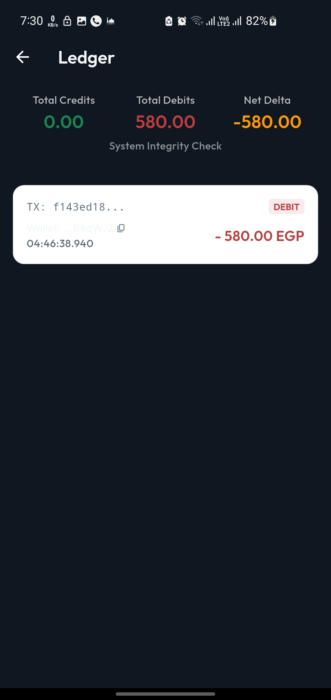

# 🏦 Boklo Wallet

> **A Backend-Authoritative, Event-Driven FinTech Application built with Flutter & Firebase.**

---

## 📖 Overview

Boklo Wallet is a next-generation financial application designed with **correctness, security, and scalability** as its core principles. Unlike traditional CRUD applications, Boklo enforces a strict **Ledger-Based Architecture** where the backend (Cloud Functions & Firestore) acts as the single source of truth for all financial transactions. The Flutter client serves purely as a reactive observer, ensuring data integrity and preventing client-side manipulation.

### Key Features

- **💸 Secure Transfers**: Idempotent P2P transfers powered by Cloud Functions.
- **🔒 Bank-Grade Security**: Backend-authoritative balance management.
- **⚡ Event-Driven**: Real-time updates via Eventarc and Firestore streams.
- **📱 Modern UI**: Built with Flutter 3.x, utilizing BLoC for predictable state management.
- **🛠️ Developer Experience**: Full support for Firebase Emulators and Flavor-based environments.

---

## ⚡ Core Technical Concepts

Boklo is built on advanced FinTech engineering principles to ensure zero data loss and maximum security.

### 📓 Ledger-Based Architecture
- **Immutable Ledger**: Every financial movement is recorded as an append-only entry. Balances are derived views, not direct state.
- **Source of Truth**: The ledger is the absolute authority for auditability and compliance.

### 🔄 Atomic Transactions & Integrity
- **Firestore Transactions**: All wallet updates use multi-document atomic transactions to guarantee consistency.
- **Atomic Increments**: Use of operational transformations to prevent race conditions during concurrent updates.
- **Idempotency**: All transfer requests use unique keys to prevent double-spending or re-processing.

### 📡 Event-Driven System
- **Eventarc Routing**: Decoupled architecture where actions trigger Cloud Events (e.g., `transaction.completed`).
- **Cloud Functions (2nd Gen)**: Stateless, auto-scaling backend logic triggered by events or HTTPS.
- **Asynchronous Side-Effects**: Notifications and logging are handled out-of-band to keep the main flow fast.

### 🛡️ Security & Scalability
- **Firestore Security Rules**: Field-level security ensuring users only access their own data and cannot mutate sensitive balance fields.
- **Firebase App Check**: Protection against bot traffic and unauthorized API usage using Play Integrity/App Attest.
- **Custom Indexes**: Optimized composite indexes to support performant ledger queries and filtering.
- **Real-time Notifications**: Integrated FCM for backend-triggered push alerts.

---

## 📸 Showcase & Demo

### 🎥 Video Demonstration
> Watch the app in action: **[Boklo Wallet Demo Video](https://drive.google.com/file/d/1WIKmr1MGux7wckQmstE6nW4CbeBBNtF6/view?usp=sharing)**

### 🖼️ App Screens

| Wallet Home | Transfer Money | Payment Requests |
| :---: | :---: | :---: |
|  |  |  |

| Contacts | Notifications | Profile Settings |
| :---: | :---: | :---: |
|  |  |  |

| Alert Settings | Personal Info | Login |
| :---: | :---: | :---: |
|  |  |  |

---

## 🔬 Backend Transparency (Ledger Debug)

Boklo includes a built-in **Ledger Debugger** to visualize the immutable transaction history and ensure financial integrity during development.

| Ledger Audit Log |
| :---: |
|  |

---

## 🛠 Tech Stack

### Frontend (Flutter)

- **Framework**: Flutter 3.x
- **State Management**: `flutter_bloc` (Cubit pattern)
- **Dependency Injection**: `get_it`, `injectable`
- **Routing**: `go_router`
- **Code Generation**: `freezed`, `json_serializable`
- **Networking**: Cloud Functions SDK, Firestore SDK
- **Linting**: `very_good_analysis`

### Backend (Firebase)

- **Compute**: Cloud Functions (2nd Gen, TypeScript)
- **Database**: Cloud Firestore (NoSQL)
- **Message Bus**: Eventarc (CloudEvents)
- **Authentication**: Firebase Auth
- **Observability**: Cloud Logging
- **Security**: App Check (Play Integrity / App Attest)

---

## 🏗 Architecture

For a deep dive into the system design, please read:
👉 **[Architecture Guide](docs/architecture.md)**

### Core Principles

1.  **Client as Observer**: The App never writes to `balance`. It only requests actions.
2.  **Ledger is Truth**: All financial state is derived from an append-only Ledger.
3.  **Event-Driven**: Actions trigger Events -> Events trigger Functions -> Functions update State.

---

## 🚀 Getting Started

### Prerequisites

- [Flutter SDK](https://docs.flutter.dev/get-started/install) (Latest Stable)
- [Firebase CLI](https://firebase.google.com/docs/cli) (`npm install -g firebase-tools`)
- [Java JDK 17](https://www.oracle.com/java/technologies/javase/jdk17-archive-downloads.html) (Required for Android builds)
- [CocoaPods](https://cocoapods.org/) (for iOS)

### Installation

1.  **Clone the repository**:
    ```bash
    git clone https://github.com/your-org/boklo-wallet.git
    cd boklo-wallet
    ```
2.  **Install Dependencies**:
    ```bash
    flutter pub get
    cd functions && npm install && cd ..
    ```
3.  **Setup Environment**:
    - Ensure you have the `google-services.json` (Android) and `GoogleService-Info.plist` (iOS) in the correct directories for both `dev` and `prod` flavors.

---

## 🏃‍♂️ Running the App

### 1. Developer Mode (Emulators) - **RECOMMENDED**

This mode runs the app against local Firebase Emulators. It is safe, fast, and does not touch production data.

1.  **Start Emulators**:
    ```bash
    ./scripts/start_emulators.sh
    ```
2.  **Run App (Debug)**:
    ```bash
    flutter run --debug --flavor dev -t lib/main_dev.dart
    ```

    - _Note: The app will automatically connect to emulators (`10.0.2.2` for Android, `localhost` for iOS/Web)._
    - _If you customize ports in `firebase.json`, pass matching Dart defines (`FIRESTORE_EMULATOR_PORT`, `FUNCTIONS_EMULATOR_PORT`, `AUTH_EMULATOR_PORT`, `STORAGE_EMULATOR_PORT`)._

### 2. Production Mode (Real Backend)

**⚠️ WARNING**: This connects to the LIVE production database. Use with caution.

1.  **Run App (Prod)**:
    ```bash
    flutter run --debug --flavor prod -t lib/main_prod.dart
    ```

    - _Note: Ensure your device's SHA-1 fingerprint is added to the Firebase Console, otherwise App Check and Auth will fail._

---

## 📦 Deployment

### Cloud Functions & Rules

Deploying backend logic is separate from the app release.

1.  **Deploy Functions**:
    ```bash
    firebase deploy --only functions
    ```
2.  **Deploy Security Rules**:
    ```bash
    firebase deploy --only firestore:rules
    ```

### Android Build

To build the production APK/Bundle:

```bash
flutter build apk --flavor prod -t lib/main_prod.dart
```

### iOS Build

To build the production IPA:

```bash
flutter build ipa --flavor prod -t lib/main_prod.dart
```

---

## 📂 Project Structure

```
lib/
├── config/             # App-wide routing, theme, env config
├── core/               # DI, Services, global Utilities
├── features/           # Feature-based modules (Auth, Wallet, Transfers)
│   ├── data/           # Repositories & DTOs
│   ├── domain/         # Entities & UseCases (Business Logic)
│   └── presentation/   # BLoCs & UI Widgets
├── shared/             # Reusable UI components
└── main_*.dart         # Entry points (Flavor-specific)
functions/
├── src/                # TypeScript Source
│   ├── index.ts        # Entry point
│   └── transfers.ts    # Transfer logic
└── package.json
```

---

## 🆘 Troubleshooting

- **"Notification not working"**: Ensure the correct `google-services.json` is used and your device SHA-1 is registered in Firebase Console. Check `AndroidManifest.xml` for the default channel ID.
- **"Emulator connection refused"**: Start emulators with `./scripts/start_emulators.sh`. If running on a physical Android device, start the app with `--dart-define=EMULATOR_HOST=YOUR_PC_IP`.
- **"App Check Token Error"**: Verify you are using the correct Debug Token from the logs in the Firebase Console.
